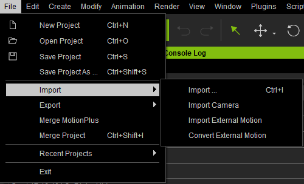

# IC8 Python API:RLPy RFileIO
&emsp;&emsp;对应 [**官方网页**](https://wiki.reallusion.com/IC8_Python_API:RLPy_RFileIO)。
&ensp;&ensp;&ensp;&ensp;Corresponding [**official page**](https://wiki.reallusion.com/IC8_Python_API:RLPy_RFileIO).

&emsp;&emsp;最后编辑：2023.10.11
&ensp;&ensp;&ensp;&ensp;Last modified: 2023.10.11
___
### 介绍 - Description
&emsp;&emsp;这个类负责载入和保存文件，功能丰富，一般和 [**RApplication**](./RApplication.md) 的函数配合使用。目前可以加载与 iClone 相关的文件、对象、Alembic 文件，并且输出 FBX 文件。
> Alembic 是一种可交换的计算机图形文件格式，由 Sony Pictures Imageworks 和 Industrial Light & Magic开发。它的重点是处理那些相同镜头或资源但不同团队之间的几何（模型）。通俗地说，Alembic 是一种开源的 3D 模型交换格式，可以将动画保存到几何体中。
___
### 类成员 - Class Methods
> #### **RLPy.RFileIO.LoadFile(strFilePath, bRecordStep = True)**
&emsp;&emsp;该函数负责导入文件到 iClone 场景中。需要注意的是，iClone 中的导入有不同的应用条件，例如：

①菜单栏导入：只能导入模型、物品、背景等文件，默认导入位置是场景的 (0, 0, 0) 位置，部分文件不可导入；



②从素材库双击导入：对于动作类文件的导入，**需要提前在场景中选中对象**，才能导入，否则会弹窗提示导入失败。在该函数的表现即为若未提前在场景中选中对象，则调用该函数会返回 RStatus.Failure；


③从文件管理器或素材库拖拽导入：对于模型或物品类文件的导入，拖拽时最后松开鼠标左键的位置即为导入位置。对于动作类文件的导入，拖拽时后松开鼠标左键时被框选中的对象即为导入位置。

**参数：**

&emsp;&emsp;**strFilePath** - str[IN]: 文件路径

&emsp;&emsp;**bRecordStep** - bool[IN]: 该导入是否记录在 Undo/Redo 管理中，为 True 则记录，举个例子：为 False 时按 Ctrl + Z 不会撤销该导入操作

**返回值：**

&emsp;&emsp;return - RStatus[OUT]: 导入成功与否

``` python {.line-numbers}
def run_script():
    # 先框选模型
    avatar = RLPy.RScene.GetAvatars(RLPy.EAvatarType_All)[0]
    RLPy.RScene.SelectObject(avatar)
    # 再导入 T-pose 数据
    path_template_data = RLPy.RApplication.GetTemplateDataPath()
    path_still_pose = path_template_data + "\\Animation\\Motion Plus\\Still Pose\\_Default.iMotionPlus"
    status = RLPy.RFileIO.LoadFile(path_still_pose, False)
    print(True if status == RLPy.RStatus.Success else False)
```

</br>
</br>

> #### **RLPy.RFileIO.LoadMotion(strFilePath, kTime, spObject)**
&emsp;&emsp;该函数负责在指定的时间导入动作文件到指定的模型或物体中，**需要提前在场景中选中对象**。

**参数：**

&emsp;&emsp;**strFilePath** - str[IN]: 指定动作文件的路径
&emsp;&emsp;**kTime** - RLPy.RTime[IN]: 指定动作导入的起始时间
&emsp;&emsp;**spObject** - RLPy.RIObject[IN]: 指定导入的模型或物品

**返回值：**

&emsp;&emsp;return - RLPy.RStatus[OUT]: 导入成功与否

``` python {.line-numbers}
def run_script():
    # 先框选模型
    avatar = RLPy.RScene.GetAvatars(RLPy.EAvatarType_All)[0]
    RLPy.RScene.SelectObject(avatar)
    # 再导入动作数据
    path_template_data = RLPy.RApplication.GetTemplateDataPath()
    path_motion = path_template_data + "\\Animation\\Motion\\1.Human Male\\Idle\\Breathe_1.rlMotion"
    current_time = RLPy.RGlobal.GetTime()
    status = RLPy.RFileIO.LoadMotion(path_motion, current_time, avatar)
    print(True if status == RLPy.RStatus.Success else False)
```