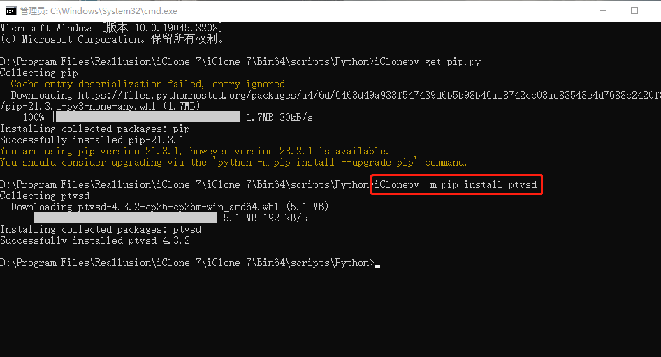

# iClone to VSCode
## 前言 - Preface
&emsp;&emsp;因为 iClone 的 ConsoleLog 显示的信息有限，容易因为宽度不够而被隐藏报错信息的后半段。又因为 iClone 有自己独立的代码运行环境，虽然可以调用系统中的库，但 VSCode 似乎是没法直接运行或调试 iClone 代码的，因为 RLPy 这个库是安装在 iClone 自己独立的代码运行环境中的。（需要注意的是，PyPI 和 pip install 安装的 RLPy 非彼RLPy，iClone 自己独立的代码运行环境也有自己的 python）
&emsp;&emsp;网上有一位老哥通过局域网广播 iClone 调试信息，VSCode 接收广播的方法实现了在 VSCode 上调试 iClone 代码，这种方法本来是用在远程调试服务器代码的。参考连接如下：[https://www.youtube.com/watch?v=CBZ23CQU4jQ](https://www.youtube.com/watch?v=CBZ23CQU4jQ)，[https://wiki.reallusion.com/IC_Python_API:Python_Extension_Libraries](https://wiki.reallusion.com/IC_Python_API:Python_Extension_Libraries)。

## 解决方案
### 方案思路
①在 iClone 的运行环境中安装远程调试库 ptvsd；

②在 VSCode luanch.json 中添加 iClone 本地调试配置；

③要调试的代码头部添加本地调试连接代码；

④在 iClone 中运行代码；

⑤在 VSCode 中开始调试。

### 配制方法
#### ①安装 ptvsd
&emsp;&emsp;在环境变量的系统变量里的 Path 中添加一个变量，这个变量的路径是你安装的 iClone 的文件夹下的 Bin64 文件夹的路径。


</br>
</br>

&emsp;&emsp;进入你安装的 iClone 的文件夹下的 Bin64/script/Python 文件夹，在这个文件夹运行命令提示符 cmd。


</br>


</br>
</br>

&emsp;&emsp;因为要用 pip 来安装 ptvsd 库，而 iClone 的运行环境里没有 pip，所以要先安装 pip。输入 iClonepy get-pip.py 并回车，等待下载并安装完成即可，这里我已经安装过了。然后再安装 ptvsd，等待下载并安装完成即可。


</br>



> 注意：指令里的 iClonepy 不要漏了，它的作用大概是指定用 iClone 文件夹中的 iClonepy.exe 来安装，这个 iClonepy.exe 相当于 iClone 的 python.exe，会安装在 iClone 的运行环境中。

</br>
</br>

#### ②配置 luanch.json
&emsp;&emsp;在 VSCode 中点击“运行和调试”，再点击上方的齿轮打开 luanch.json 文件，添加代码如下，其中 "name" 可以自己改：
``` json {.line-numbers}
        {
            "name": "Python Attach",
            "type": "python",
            "request": "attach",
            "port": 5678,
            "host": "localhost",
        },
```


</br>


</br>
</br>

#### ③头部添加代码
&emsp;&emsp;在要调试的代码的头部添加代码如下，这里以 Hello World 代码举例：


``` python {.line-numbers}
import ptvsd

ptvsd.enable_attach(address=("localhost", 5678), redirect_output=True)
ptvsd.wait_for_attach()
```


</br>
</br>

#### ④在 iClone 中运行代码
&emsp;&emsp;点击 iClone 菜单栏的 Script 下的 Load Python，选中自己要调试的代码的 python 文件。当你发现选中并打开后，你的 iClone 卡住了，那就说明 iClone 正在等待接收端的接入，可以进行下一步了。


</br>
</br>

#### ⑤在 VSCode 中调试代码
&emsp;&emsp;回到 VSCode 中，切换调试配置为你刚刚添加的那个，我的是 Python Attach。打上断点，开始调试运行，你会发现只要阻塞在断点处，iClone 就是卡住的状态，不打断点持续运行的时候 iClone 就是流畅的。iClone 的输出信息和错误信息都可以在 VSCode 中查看了，而且更全。


</br>


