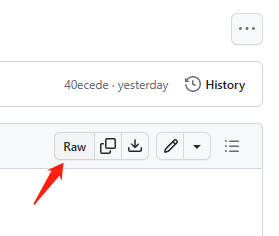

# iClone-Python-API
## 前言 - Preface
该仓库是对 iClone 官网 API 文档的翻译和个人解读。

This repository is a translation and personal interpretation of the API documentation on the iClone official website.

该仓库主要将本人在开发中使用过的 API 进行翻译，并对 API 进行较为详细的介绍，尽可能地给出可运行代码。

This repository mainly translates the APIs that I have used in development, and introduces the APIs in more detail, and gives runnable codes as much as possible.

## iClone Python API
以下为两个 iClone 版本对应的 API 文档。

The following are the API documents corresponding to the two iClone versions.

github:

[iClone 7 Python API](./IC7_Python_API/Index.md)

[iClone 8 Python API](./IC8_Python_API/Index.md)

github raw:

[iClone 7 Python API](https://raw.githubusercontent.com/Philip117/iClone-Python-API/master/IC7_Python_API/Index.md)

[iClone 8 Python API](https://raw.githubusercontent.com/Philip117/iClone-Python-API/master/IC8_Python_API/Index.md)

## 建议 - Suggestions
建议采用 Raw 模式来阅读。

